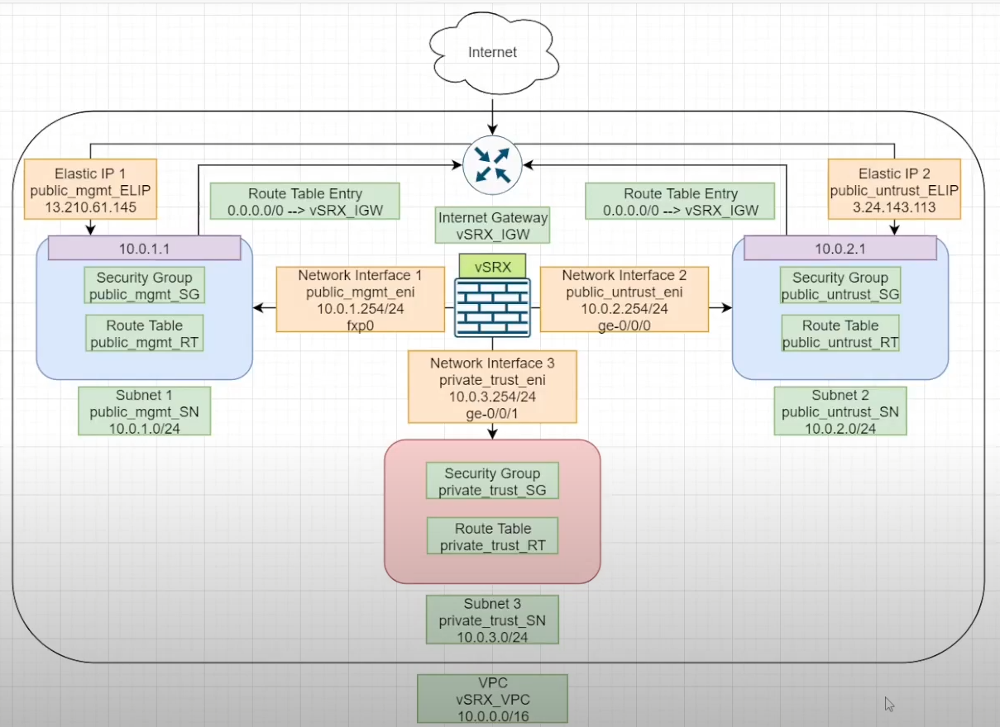

# vSRX-AWS-Single

## Overview

This Terraform plan deploys a virtual Juniper Networks vSRX firewall in AWS. The plan uses the official vSRX Amazon Machine Image (AMI) and provisions an EC2 instance in a specified VPC and subnet. The instance is configured with the appropriate security group rules to allow traffic to and from the vSRX. The plan also creates an Elastic IP address and associates it with the instance for easy access. Once deployed, the vSRX can be used to secure traffic flowing in and out of the VPC, and can be configured using the Junos CLI or web interface.

### Requirements:

	- Terraform 1.0 or later
	- AWS credentials with permission to provision EC2 instances, Elastic IP addresses, and security groups
	- Knowledge of AWS VPC and subnet configuration
	- Familiarity with Junos CLI or web interface for vSRX configuration

### Usage:

	1. Clone the repository to your local machine.
	2. Create a terraform.tfvars file with the necessary variables for your deployment. Example variables are provided in variables.tf.
	3. Run terraform init to download the necessary modules and providers.
	4. Run terraform apply to deploy the vSRX instance in AWS.
	5. Access the vSRX using the Elastic IP address created by the plan.

This design follows on from the work by FinAck in this video. [Juniper vSRX on AWS by FinAck](https://www.youtube.com/watch?v=JT7jb8VxA7c)

## Design

Note: This plan is for testing and educational purposes only and should not be used in production environments without proper testing and validation.
